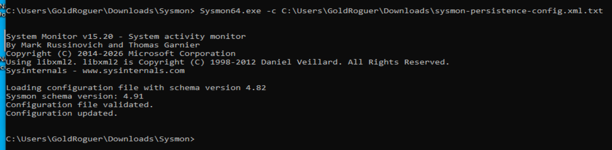
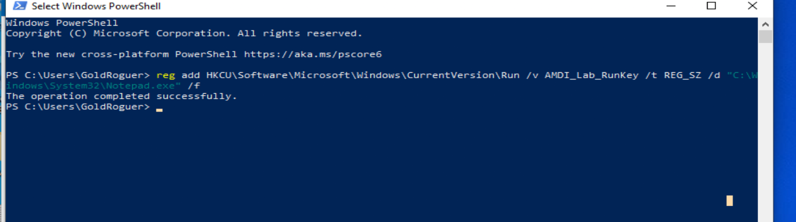
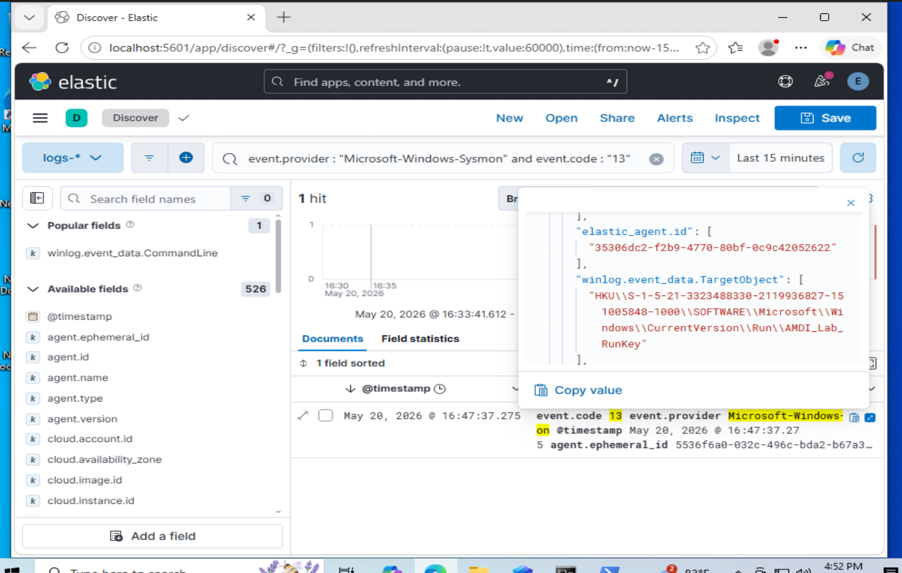
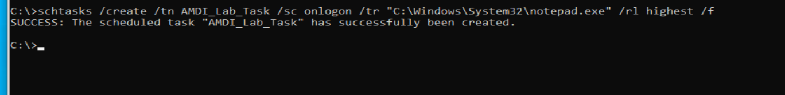
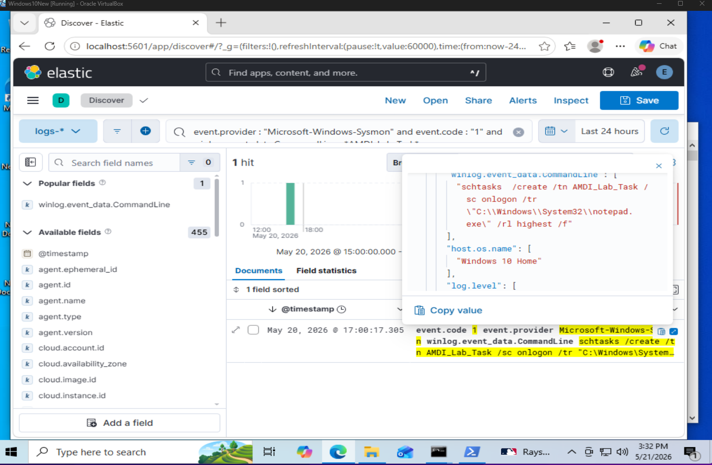
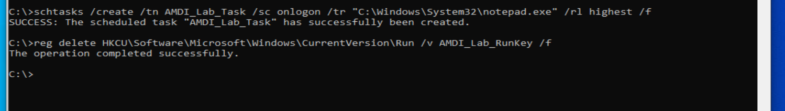
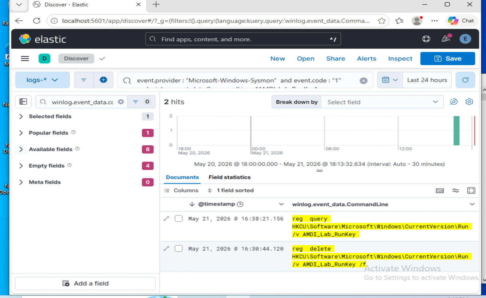
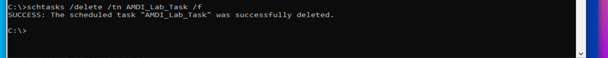

# Elastic-Windows-Persistence-Detection-Lab
SOC lab using Sysmon and Elastic/Kibana to detect Windows persistence via Registry Run Keys and Scheduled Tasks.

## Overview

This lab demonstrates how Windows persistence techniques can be simulated, detected, analyzed, and cleaned up using Sysmon telemetry and Elastic/Kibana.

The goal of this project was to detect two common Windows persistence methods:

1. Registry Run Key persistence
2. Scheduled Task persistence

The lab was performed in a controlled Windows virtual machine environment. The simulated persistence actions were benign and used `notepad.exe` as the test executable.

---

## Lab Objectives

- Configure Sysmon to capture registry persistence activity
- Simulate persistence using a Windows Registry Run Key
- Detect Registry Run Key activity in Kibana using Sysmon Event ID 13
- Simulate persistence using a Scheduled Task
- Detect Scheduled Task creation using Sysmon Event ID 1
- Document KQL detection logic
- Remove the persistence artifacts
- Verify cleanup locally using Windows command-line tools

---

## Lab Environment

| Component | Role |
|---|---|
| Windows 10 VM | Monitored endpoint |
| Sysmon | Endpoint telemetry collection |
| Elastic Agent | Log forwarding |
| Elasticsearch | Log indexing and storage |
| Kibana | Log analysis and investigation |
| CMD | Simulation and cleanup commands |
| Windows Registry | Persistence simulation |
| Windows Task Scheduler | Persistence simulation |

---

## Tools Used

- Sysmon
- Elastic Agent
- Elasticsearch
- Kibana
- Windows Command Prompt
- Windows Registry
- Windows Task Scheduler

---

## MITRE ATT&CK Mapping

| Technique | Description |
|---|---|
| T1547.001 | Registry Run Keys / Startup Folder |
| T1053.005 | Scheduled Task / Job: Scheduled Task |

---

# 1. Sysmon Configuration Update

## What Was Done

Sysmon was reconfigured to capture registry activity related to Windows Run and RunOnce keys.

These registry locations are commonly used for persistence because programs listed there can execute automatically when a user logs in.

## Sysmon Configuration File

The following Sysmon XML configuration was used:

```xml
<Sysmon schemaversion="4.82">
  <EventFiltering>
    <ProcessCreate onmatch="exclude" />
    <RegistryEvent onmatch="include">
      <TargetObject condition="contains">\Software\Microsoft\Windows\CurrentVersion\Run</TargetObject>
      <TargetObject condition="contains">\Software\Microsoft\Windows\CurrentVersion\RunOnce</TargetObject>
    </RegistryEvent>
  </EventFiltering>
</Sysmon>
```

## Sysmon Configuration Update Command

```cmd
Sysmon64.exe -c "C:\Users\GoldRoguer\Downloads\sysmon-persistence-config.xml"
```

## Why This Matters

Sysmon Event ID 13 records registry value set events. This allows analysts to detect when persistence-related registry keys are created or modified.



---

# 2. Registry Run Key Persistence Simulation

## What Was Done

A Registry Run Key was created under the current user's registry hive.

This simulates a common persistence technique where a program is configured to execute automatically when the user logs in.

## Command Used

```cmd
reg add HKCU\Software\Microsoft\Windows\CurrentVersion\Run /v AMDI_Lab_RunKey /t REG_SZ /d "C:\Windows\System32\notepad.exe" /f
```

## Command Breakdown

| Command Part | Meaning |
|---|---|
| `reg add` | Adds a registry value |
| `HKCU` | Targets the current user's registry hive |
| `Software\Microsoft\Windows\CurrentVersion\Run` | Registry path used for logon persistence |
| `/v AMDI_Lab_RunKey` | Name of the registry value created |
| `/t REG_SZ` | Creates a string value |
| `/d "C:\Windows\System32\notepad.exe"` | Data stored in the registry value |
| `/f` | Forces the action without confirmation |

## Why This Matters

In a real attack, an adversary could use this registry location to automatically execute malware or a script when the user logs in.

In this lab, `notepad.exe` was used as a safe benign payload.



---

# 3. Registry Run Key Detection in Kibana

## What Was Detected

After creating the Registry Run Key, Kibana was used to search Sysmon telemetry for registry modification events.

The event was detected using Sysmon Event ID 13.

## KQL Query Used

```kql
event.provider : "Microsoft-Windows-Sysmon" and event.code : "13"
```

## More Specific KQL Query

```kql
event.provider : "Microsoft-Windows-Sysmon" and event.code : "13" and winlog.event_data.TargetObject : *AMDI_Lab_RunKey*
```

## Important Fields Reviewed

| Field | Purpose |
|---|---|
| `event.provider` | Confirms the event came from Sysmon |
| `event.code` | Identifies the Sysmon event type |
| `winlog.event_data.TargetObject` | Shows the registry key/value modified |
| `winlog.event_data.Details` | Shows the value data written |
| `winlog.event_data.Image` | Shows the process that modified the registry |

## Detection Result

The event showed activity related to:

```text
HKCU\Software\Microsoft\Windows\CurrentVersion\Run\AMDI_Lab_RunKey
```

This confirmed that Elastic successfully detected the Registry Run Key persistence activity.



---

# 4. Scheduled Task Persistence Simulation

## What Was Done

A Scheduled Task was created to simulate another common persistence technique.

The task was configured to execute `notepad.exe` when the user logs in.

## Command Used

```cmd
schtasks /create /tn AMDI_Lab_Task /sc onlogon /tr "C:\Windows\System32\notepad.exe" /rl highest /f
```

## Command Breakdown

| Command Part | Meaning |
|---|---|
| `schtasks` | Windows command-line tool for managing scheduled tasks |
| `/create` | Creates a new scheduled task |
| `/tn AMDI_Lab_Task` | Sets the task name |
| `/sc onlogon` | Runs the task when the user logs in |
| `/tr "C:\Windows\System32\notepad.exe"` | Defines the program the task will run |
| `/rl highest` | Runs the task with the highest privileges available |
| `/f` | Forces creation if the task already exists |

## Why This Matters

Scheduled Tasks are commonly reviewed during SOC investigations because they can be used by attackers to maintain persistence on a Windows host.

In this lab, the task was benign and used only for detection practice.



---

# 5. Scheduled Task Detection in Kibana

## What Was Detected

Elastic detected the creation of the Scheduled Task through Sysmon Event ID 1.

Sysmon Event ID 1 represents process creation.

In this case, the process was:

```text
schtasks.exe
```

## KQL Query Used

```kql
event.provider : "Microsoft-Windows-Sysmon" and event.code : "1" and winlog.event_data.CommandLine : *AMDI_Lab_Task*
```

## Alternative Query

```kql
event.provider : "Microsoft-Windows-Sysmon" and event.code : "1" and winlog.event_data.Image : *schtasks*
```

## Important Fields Reviewed

| Field | Purpose |
|---|---|
| `event.provider` | Confirms the event came from Sysmon |
| `event.code` | Confirms process creation activity |
| `winlog.event_data.Image` | Shows `schtasks.exe` was executed |
| `winlog.event_data.CommandLine` | Shows the full scheduled task creation command |
| `winlog.event_data.ParentImage` | Shows the parent process that launched the command |
| `user.name` | Shows the user context |

## Detection Result

The command line showed:

```text
schtasks /create /tn AMDI_Lab_Task /sc onlogon /tr "C:\Windows\System32\notepad.exe" /rl highest /f
```

This confirmed that Elastic detected the Scheduled Task persistence activity.



---

# 6. Detection Logic

## Registry Run Key Persistence Detection

```kql
event.provider : "Microsoft-Windows-Sysmon" and event.code : "13" and winlog.event_data.TargetObject : *CurrentVersion\\Run*
```

## Lab-Specific Registry Run Key Detection

```kql
event.provider : "Microsoft-Windows-Sysmon" and event.code : "13" and winlog.event_data.TargetObject : *AMDI_Lab_RunKey*
```

## Scheduled Task Persistence Detection

```kql
event.provider : "Microsoft-Windows-Sysmon" and event.code : "1" and winlog.event_data.Image : *schtasks*
```

## Lab-Specific Scheduled Task Detection

```kql
event.provider : "Microsoft-Windows-Sysmon" and event.code : "1" and winlog.event_data.CommandLine : *AMDI_Lab_Task*
```

---

# 7. Cleanup and Verification

## What Was Done

After confirming detection in Elastic, both persistence artifacts were removed from the Windows VM.

Cleanup was verified locally using Windows command-line tools.

---

## Registry Run Key Removal

### Command Used

```cmd
reg delete HKCU\Software\Microsoft\Windows\CurrentVersion\Run /v AMDI_Lab_RunKey /f
```

### Command Breakdown

| Command Part | Meaning |
|---|---|
| `reg delete` | Deletes a registry value |
| `HKCU\Software\Microsoft\Windows\CurrentVersion\Run` | Registry path where the persistence value was created |
| `/v AMDI_Lab_RunKey` | Specifies the value to delete |
| `/f` | Forces deletion without confirmation |

---

## Registry Run Key Verification

### Command Used

```cmd
reg query HKCU\Software\Microsoft\Windows\CurrentVersion\Run /v AMDI_Lab_RunKey
```

### Expected Result

```text
ERROR: The system was unable to find the specified registry key or value.
```

This confirms that the Registry Run Key was successfully removed.



---

## Registry Run Key Cleanup Evidence in Kibana

In addition to verifying the cleanup locally, Kibana also showed Sysmon process creation events related to the registry cleanup commands.

The query returned events showing both the registry deletion command and the verification query for the `AMDI_Lab_RunKey` value.

### KQL Query Used

```kql
event.provider : "Microsoft-Windows-Sysmon" and event.code : "1" and winlog.event_data.CommandLine : *AMDI_Lab_RunKey*
```

### Evidence Observed

The results included command-line activity related to:

```text
reg delete HKCU\Software\Microsoft\Windows\CurrentVersion\Run /v AMDI_Lab_RunKey /f
```

and:

```text
reg query HKCU\Software\Microsoft\Windows\CurrentVersion\Run /v AMDI_Lab_RunKey
```

This provided additional evidence that the cleanup activity was visible through Sysmon process creation telemetry.



---

## Scheduled Task Removal

### Command Used

```cmd
schtasks /delete /tn AMDI_Lab_Task /f
```

### Command Breakdown

| Command Part | Meaning |
|---|---|
| `schtasks` | Windows tool used to manage scheduled tasks |
| `/delete` | Deletes a scheduled task |
| `/tn AMDI_Lab_Task` | Specifies the task name |
| `/f` | Forces deletion without confirmation |

---

## Scheduled Task Verification

### Command Used

```cmd
schtasks /query /tn AMDI_Lab_Task
```

### Expected Result

```text
ERROR: The system cannot find the file specified.
```

This confirms that the Scheduled Task was successfully removed.



---

# 8. Investigation Summary

## Registry Run Key Persistence

| Item | Result |
|---|---|
| Technique | Registry Run Key |
| MITRE Technique | T1547.001 |
| Test Value | AMDI_Lab_RunKey |
| Payload | notepad.exe |
| Detected In | Elastic/Kibana |
| Main Event ID | Sysmon Event ID 13 |
| Cleanup Verified | Yes, using `reg query` |

---

## Scheduled Task Persistence

| Item | Result |
|---|---|
| Technique | Scheduled Task |
| MITRE Technique | T1053.005 |
| Task Name | AMDI_Lab_Task |
| Payload | notepad.exe |
| Detected In | Elastic/Kibana |
| Main Event ID | Sysmon Event ID 1 |
| Cleanup Verified | Yes, using `schtasks /query` |

---

# 9. Key Findings

- Sysmon successfully captured Windows persistence-related activity.
- Registry Run Key persistence was detected using Sysmon Event ID 13.
- Scheduled Task persistence was detected using Sysmon Event ID 1.
- Kibana was used to manually investigate persistence activity.
- KQL queries were created to isolate specific suspicious behavior.
- Cleanup actions were performed and verified locally.
- The lab demonstrated a full workflow from persistence simulation to detection and remediation.

---

# 10. Skills Demonstrated

- Windows persistence technique analysis
- Sysmon configuration
- Sysmon Event ID 1 analysis
- Sysmon Event ID 13 analysis
- Registry Run Key investigation
- Scheduled Task investigation
- Elastic/Kibana log analysis
- KQL query development
- Endpoint telemetry analysis
- MITRE ATT&CK mapping
- Remediation and verification documentation
- SOC-style investigation workflow

---

# 11. Lessons Learned

This lab helped reinforce how Windows persistence techniques can be detected using endpoint telemetry.

The Registry Run Key simulation demonstrated how attackers may attempt to execute programs automatically at user logon.

The Scheduled Task simulation demonstrated another common method attackers may use to maintain access.

Using Sysmon and Elastic together provided visibility into both registry modifications and process creation activity.

The lab also showed the importance of validating cleanup actions after removing persistence mechanisms.

---

# 12. Conclusion

This lab demonstrated how Sysmon and Elastic/Kibana can be used to detect Windows persistence techniques in a controlled SOC lab environment.

Two persistence techniques were simulated:

1. Registry Run Key persistence
2. Scheduled Task persistence

Both techniques were detected through Sysmon telemetry and investigated in Kibana using KQL queries.

The persistence artifacts were then removed and verified locally, completing a full workflow of:

```text
Simulation → Detection → Investigation → Cleanup → Verification
```

This project strengthened practical skills in endpoint detection, Windows event analysis, KQL querying, persistence investigation, and SOC-style documentation.
